 

  

  <h3 align="center">Rick and Morty (Api Rest)</h3>
   

  

    <a href="https://youtu.be/W98SmA-GSCA">Ver video</a>
  

 

## Sobre este proyecto
RickMortyApi es una aplicación de Angular que recoge los personajes de la serie Rick y Morty la cual incorpora un buscador en su barra de navegación para la rápida búsqueda de los mismos y permite la visualización de cada personaje individualmente. Puedes iniciar sesión a través de los servicios de firebase para poder almacenar tus personajes favoritos. Para poder añadirlos, hace falta que estés logeado.
Además contiene otra página en la que se muestra una tabla en la que se pueden hacer filtrados a los personajes 

## Estructura del proyecto
RickMortyApi está basada para el uso en dispositivos de escritorio pero también permite su utilización para dispotivos móviles a través de la web.

## Tecnologías usadas

 

 
<a href="https://angular.io/">
    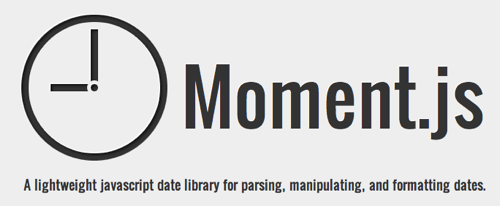
</a>

## Maquetación
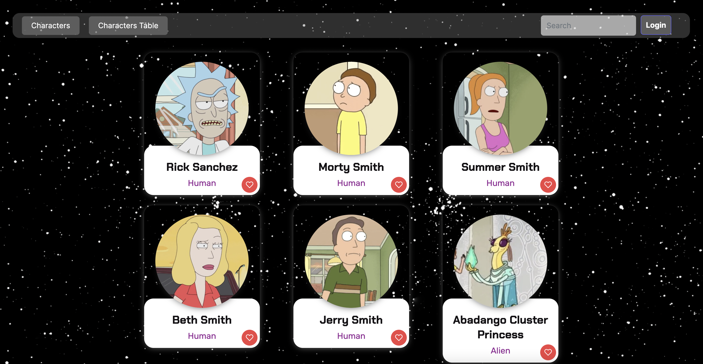
 
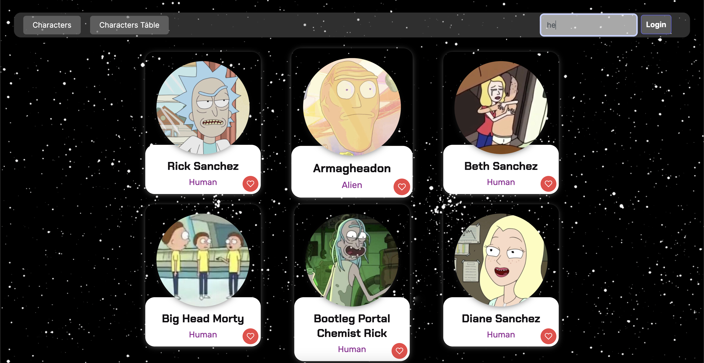
 
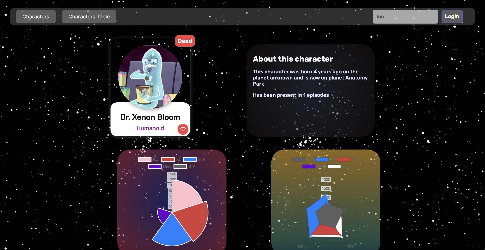
 
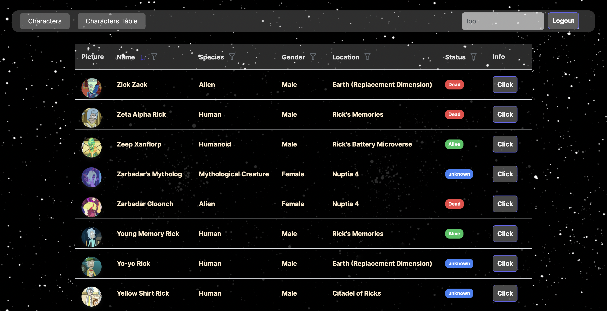
 
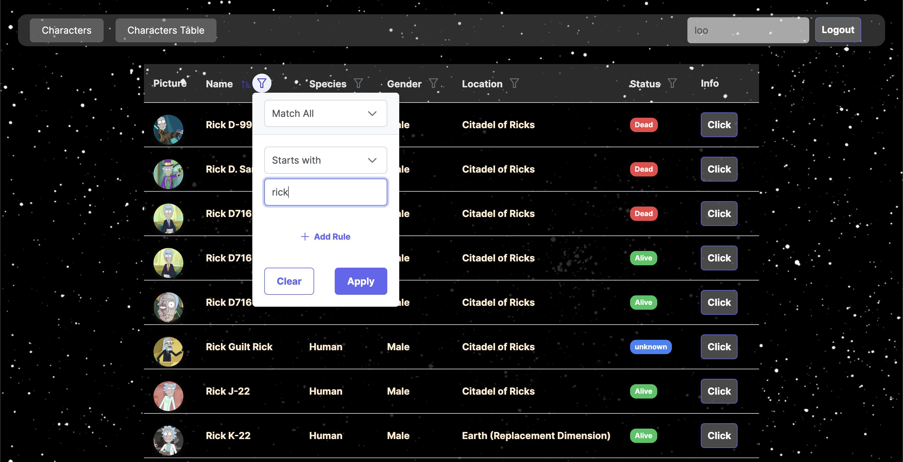
 
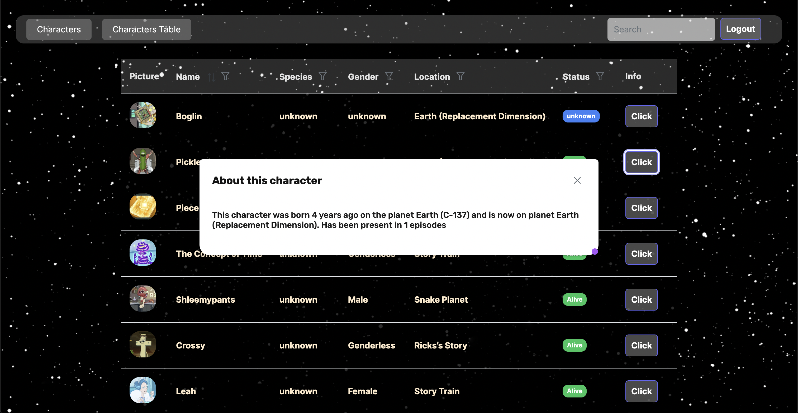
 
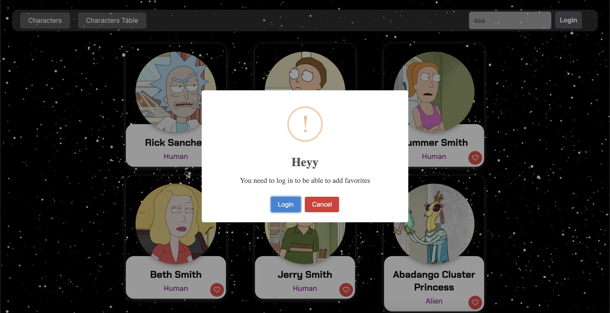
 
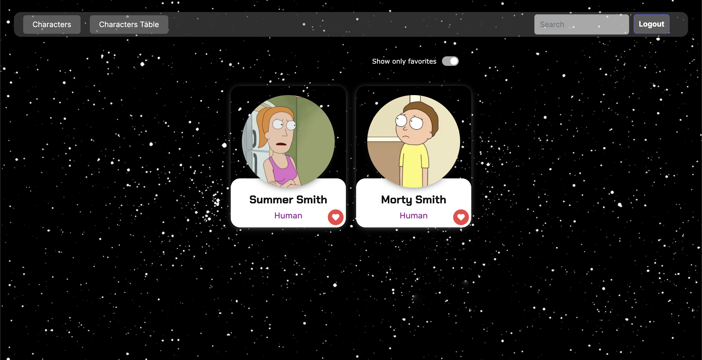
 
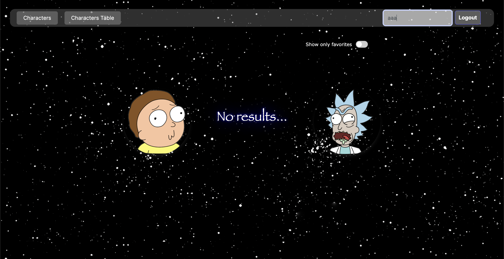
 
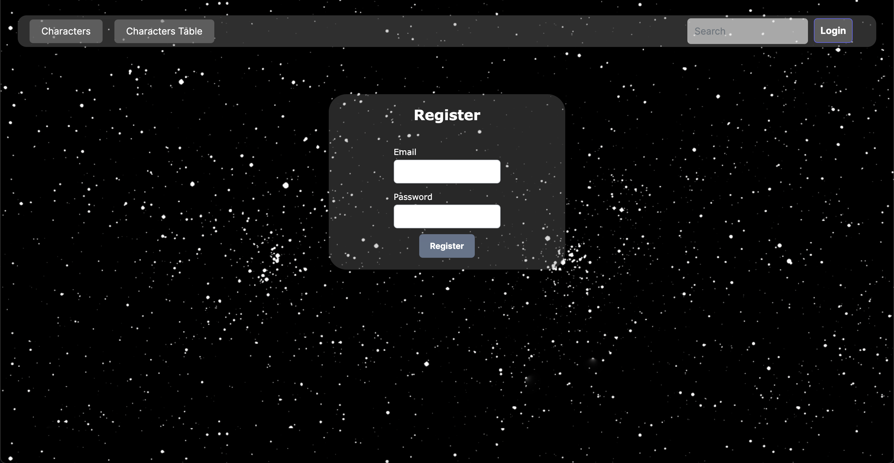
 
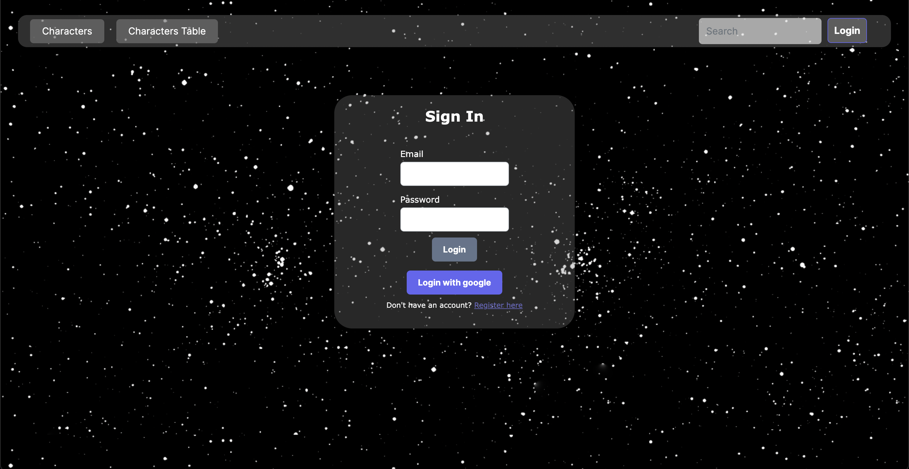
